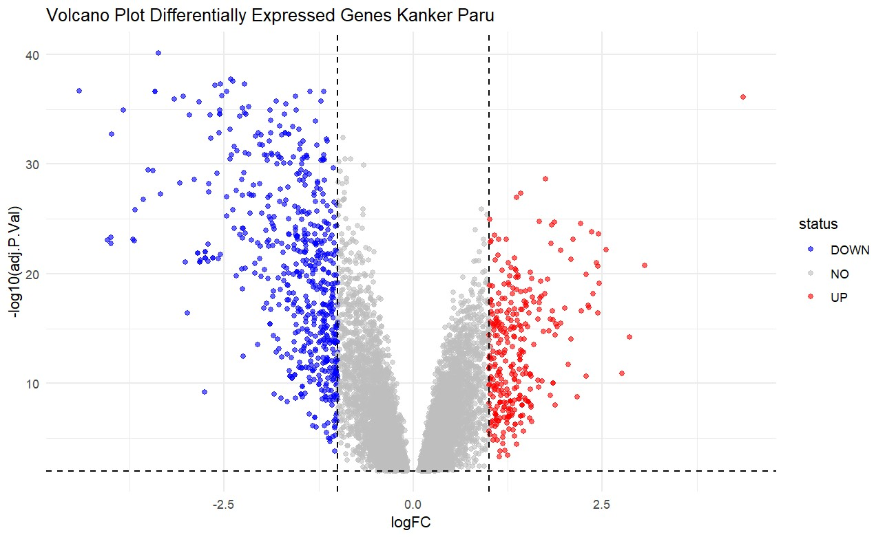
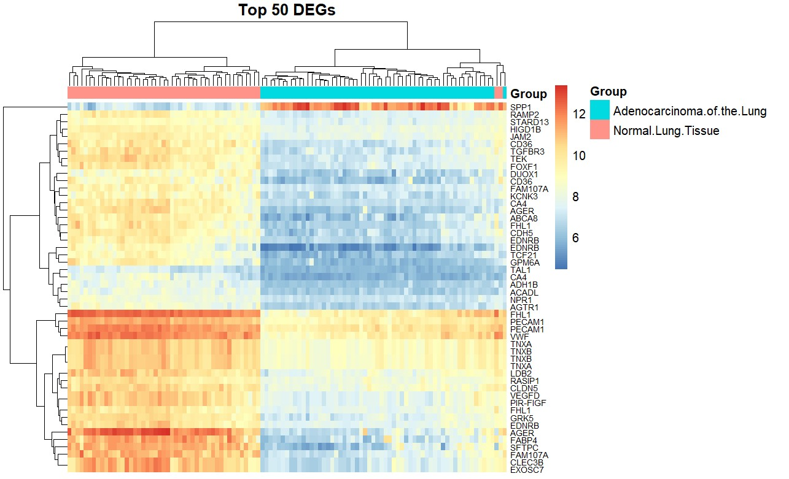
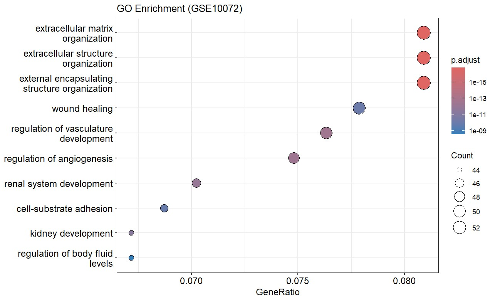
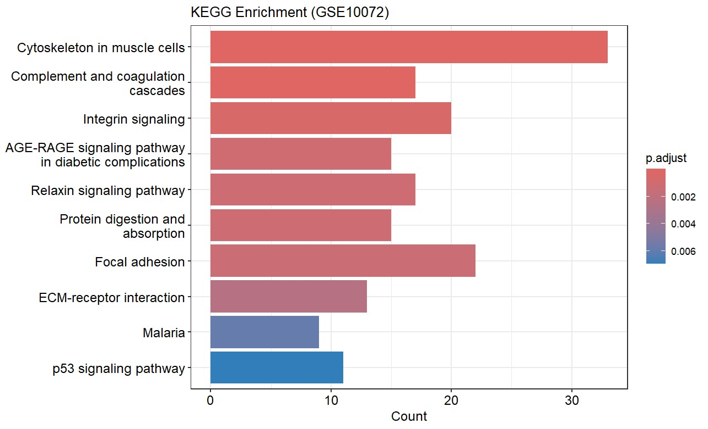

## 1. Pendahuluan

Kanker paru berjenis adenokarsinoma merupakan penyakit dengan kompleksitas molekuler yang tinggi, sehingga memerlukan pendekatan transkriptomik untuk memahami mekanisme patogenesisnya. Dalam analisis ini, digunakan dataset sekunder GSE10072 yang diperoleh dari basis data publik *Gene Expression Omnibus* (GEO) NCBI. Dataset berbasis *microarray* ini membandingkan profil ekspresi gen antara jaringan kanker paru adenokarsinoma dan jaringan paru normal, sehingga menjadikannya model yang ideal untuk mengidentifikasi gen-gen penyerta atau pemicu perkembangan sel kanker tersebut.

Tujuan utama dari analisis ini adalah mengidentifikasi *Differentially Expressed Genes* (DEGs) yang mengalami regulasi naik (*upregulation*) maupun turun (*downregulation*) pada jaringan kanker. Pola ekspresi dan signifikansi statistik dari 50 gen teratas akan divisualisasikan menggunakan *volcano plot* dan *heatmap*. Selanjutnya, analisis *enrichment* yang mencakup *Gene Ontology* (GO) dan *Kyoto Encyclopedia of Genes and Genomes* (KEGG) *pathway* diterapkan untuk menerjemahkan daftar gen tersebut menjadi informasi biologis yang bermakna, khususnya terkait fungsi seluler dan jalur molekuler yang terganggu akibat kanker.

## 2. Metode

Analisis dilakukan menggunakan bahasa pemrograman R dengan tahapan sebagai berikut:
1. **Pengumpulan Data:** Dataset microarray GSE10072 diunduh dari NCBI GEO menggunakan paket `GEOquery`.
2. **Pra-pemrosesan dan Normalisasi:** Data matriks ekspresi diekstraksi. Transformasi log2 dilakukan jika distribusi data mentah mengindikasikan perlunya normalisasi untuk menstabilkan varians.
3. **Analisis Diferensial (DEGs):** Paket `limma` digunakan untuk membangun *linear model* (`lmFit`). Kontras didefinisikan untuk membandingkan grup jaringan kanker dengan grup normal. Metode *Empirical Bayes* (`eBayes`) diterapkan untuk menghitung signifikansi, dengan batas *Adjusted p-value* (FDR) < 0.05 dan kriteria |logFC| > 1.
4. **Analisis Enrichment:** Gen-gen signifikan dipetakan dari *Probe ID* ke *Gene Symbol* dan *Entrez ID* menggunakan *database* `hgu133a.db` dan `org.Hs.eg.db`. Analisis *Gene Ontology* (GO - *Biological Process*) dan KEGG *Pathway* dilakukan menggunakan paket `clusterProfiler`.

## 3. Hasil dan Interpretasi

### 3.1. Identifikasi DEGs (Volcano Plot)

Berdasarkan analisis menggunakan `limma`, gen-gen yang mengalami diferensiasi ekspresi secara signifikan divisualisasikan menggunakan *Volcano Plot*.

**Interpretasi:**
Pada *Volcano plot* di atas, titik-titik yang berada di sisi kanan atas (logFC positif yang tinggi dan p-value signifikan) merepresentasikan gen-gen yang mengalami *upregulation* pada jaringan kanker paru. Sebaliknya, titik-titik di sisi kiri atas merepresentasikan gen-gen yang mengalami *downregulation*. Gen-gen ini merupakan kandidat biomarker yang potensial membedakan kondisi normal dan kanker.

### 3.2. Profil Ekspresi 50 DEGs Teratas (Heatmap)

Untuk melihat pola ekspresi secara lebih detail antar sampel, 50 gen teratas (berdasarkan nilai p terkecil/signifikansi tertinggi) divisualisasikan dalam bentuk *Heatmap*.

**Interpretasi:**
*Heatmap* menunjukkan klasterisasi yang jelas antara sampel jaringan kanker dan sampel normal. Warna merah menunjukkan ekspresi gen yang tinggi, sedangkan warna biru menunjukkan ekspresi rendah. Blok warna yang seragam pada grup sampel yang sama mengonfirmasi bahwa profil transkriptomik dari 50 gen teratas ini sangat konsisten dan mampu membedakan fenotipe kanker dari jaringan normal.

### 3.3. Analisis Enrichment

#### A. Gene Ontology (GO) - Biological Process
Analisis GO dilakukan untuk mengetahui proses biologis dominan dari daftar DEGs.

**Interpretasi:**
Berdasarkan *dot plot* di atas, gen-gen yang terekspresi diferensial paling signifikan diperkaya (*enriched*) dalam proses pengorganisasian **matriks ekstraseluler (*extracellular matrix organization*)**, **penyembuhan luka (*wound healing*)**, serta **regulasi pembentukan pembuluh darah (*angiogenesis / vasculature development*)**. Hal ini sejalan dengan karakteristik jaringan kanker yang aktif merombak lingkungan sekitarnya untuk mendukung proliferasi seluler yang tidak terkendali.

#### B. KEGG Pathway
Analisis KEGG memetakan gen-gen signifikan ke dalam jalur interaksi molekuler.

**Interpretasi:**
Hasil *bar plot* KEGG menunjukkan bahwa DEGs terdistribusi secara signifikan pada *pathway* yang berkaitan dengan struktur dan interaksi sel dengan lingkungannya, seperti **Sitoskeleton pada sel otot**, ***Integrin signaling***, ***Focal adhesion***, dan ***ECM-receptor interaction***. Selain itu, gen-gen ini juga memengaruhi ***p53 signaling pathway***. Gangguan pada adhesi matriks dan p53 merupakan mekanisme khas yang sering diobservasi pada perkembangan dan invasi sel adenokarsinoma paru.

## 4. Kesimpulan

Analisis transkriptomik pada dataset GSE10072 berhasil mengidentifikasi profil perubahan ekspresi gen antara jaringan adenokarsinoma paru dan jaringan paru normal. Terdapat perbedaan profil genetik yang terklaster dengan baik, sebagaimana ditunjukkan oleh *Heatmap* dan *Volcano plot*. Analisis *enrichment* lebih lanjut mengonfirmasi bahwa gen-gen yang terdampak (*DEGs*) secara dominan meregulasi proses perombakan matriks ekstraseluler (ECM), angiogenesis, serta memengaruhi jalur persinyalan adhesi fokal dan p53. Temuan ini memberikan wawasan molekuler terkait patogenesis kanker paru yang dapat dieksplorasi lebih lanjut.
